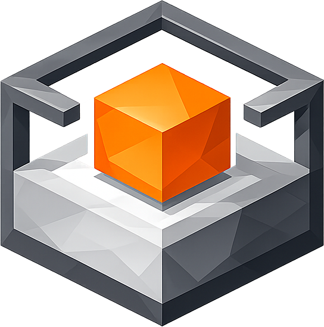

<p align="center">
  
</p>

# BuildBox

BuildBox is a containerized build environment designed to develop, build, and deliver embedded and cross-compiled projects in a reproducible way.

Every project runs in its own dedicated Docker container, isolated from the host system and from other projects. The build environment is fully defined and versioned alongside the project, so the exact same result can be reproduced months or years later, even for old releases.

## Key concepts

BuildBox organizes work around four concepts:

- **Project**: a Git repository that groups all the deliverable components for a given product. It holds the profile describing targets, packages, and tools.
- **Target**: a hardware and software platform within a project (for example a PC build or a Cortex-M3 firmware). Each target defines which packages to build, which toolchain to use, and how to test and distribute the result.
- **Package**: a software component built for a target. Packages are versioned and fetched from their own repositories. BuildBox tracks every package revision to guarantee delivery reproducibility.
- **Tool**: a toolchain or external dependency used during the build (cross-compiler, SDK, etc.). Tools are managed and versioned like packages.

## Why BuildBox

- **Reproducible builds**: every component, tool, and toolchain is pinned to an explicit revision. Rebuilding any past release starts from a known, exact state.
- **Project isolation**: each project gets its own container. Different projects with conflicting dependencies or toolchains coexist on the same machine without interference.
- **No environment setup**: developers clone a project and run `bbx`. There is no manual installation of cross-compilers, SDKs, or system libraries. The environment is self-contained.
- **Familiar workflow**: `bbx` works like any other command-line tool, from inside the project directory.
- **Host integration**: SSH keys, Git and Vim configuration are automatically shared from the host into the container. An optional shell plugin displays the active project and target in the prompt and provides tab-completion for all `bbx` commands.

Visit the [BuildBox official website](https://buildbox.trusted-objects.com).

## Usage

```
bbx --help
```

Run `bbx` from any project directory. The container is started automatically if needed.

See the [user manual](https://buildbox.trusted-objects.com/user/) for the full documentation.

## Installation

```
sudo make install
```

Installs the `bbx` launcher to `/usr/local/bin` and supporting files to `/usr/local/share/buildbox`.
See the [installation guide](https://buildbox.trusted-objects.com/getting-started/install.html) for prerequisites and details.

## License

[Read license details](LICENSE.md).

## Authors

BuildBox is developed by [Trusted Objects](https://www.trusted-objects.com).

See [credits](AUTHORS.md) file.
