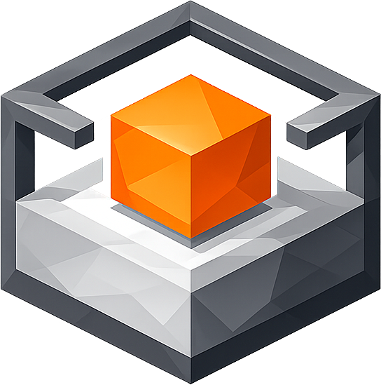

<p align="center">
  
</p>

# BuildBox

BuildBox is a containerized build environment designed to develop, build, and deliver embedded and cross-compiled projects in a reproducible way.

Every project runs in its own dedicated Docker container, isolated from the host system and from other projects. The build environment is fully defined and versioned alongside the project, so the exact same result can be reproduced months or years later, even for old releases.

Visit the [BuildBox official website](https://buildbox.trusted-objects.com).

## Key concepts

BuildBox organizes work around four concepts:

- **Project**: a directory grouping all the deliverable components of a product. Its profile, a small Git repository, describes the targets, packages, and tools.
- **Target**: a hardware and software platform within a project (for example a PC build or a Cortex-M3 firmware). Each target defines which packages to build, which toolchain to use, and how to test and distribute the result.
- **Package**: a software component built for a target. Packages are versioned and fetched from their own repositories. BuildBox tracks every package revision to guarantee delivery reproducibility.
- **Tool**: a toolchain or external dependency used during the build (cross-compiler, SDK, etc.). Tools are prebuilt, installed once, and shared by every target of the project.

## Why BuildBox

- **Reproducible builds**: every component, tool, and toolchain is pinned to an explicit revision. Rebuilding any past release starts from a known, exact state.
- **Project isolation**: each project gets its own container. Different projects with conflicting dependencies or toolchains coexist on the same machine without interference.
- **No environment setup**: developers clone a project and run `bbx` from its directory, like any other command-line tool. There is no manual installation of cross-compilers, SDKs, or system libraries. The environment is self-contained.
- **Host integration**: SSH keys, Git and Vim configuration are automatically shared from the host into the container. An optional shell plugin displays the active project and target in the prompt and provides tab-completion for all `bbx` commands.

## Installation

```
sudo make install
```

Installs the `bbx` launcher to `/usr/local/bin` and supporting files to `/usr/local/share/buildbox`.
See the [installation guide](https://buildbox.trusted-objects.com/getting-started/install.html) for prerequisites and details.

## Usage

Clone a project, then build its current target:

```
bbx clone ssh://git@server/my_project.git
cd my_project
bbx target build
```

Run `bbx` from any project directory. The container is started automatically if needed. `bbx --help` lists all commands.

See the [BuildBox Cheat Sheet](https://buildbox.trusted-objects.com/cheatsheet.pdf), and the [user manual](https://buildbox.trusted-objects.com/user/) for the full documentation.

## License

[Read license details](LICENSE.md).

## Authors

BuildBox is developed by [Trusted Objects](https://www.trusted-objects.com).

See [credits](AUTHORS.md) file.
